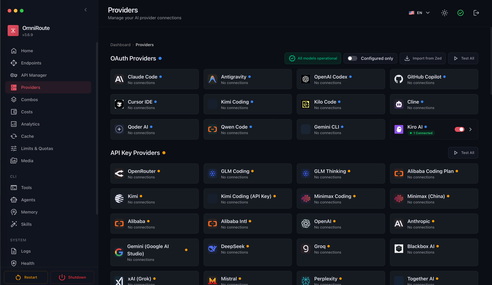

## Проверить версию `node`, должна быть `v22.22.2(LTS)`
```
node -v
```
## Устанавить `omniroute`
Сделай личную директорию для глобальных npm-пакетов:
```
mkdir -p ~/.npm-global
npm config set prefix ~/.npm-global
echo 'export PATH="$HOME/.npm-global/bin:$PATH"' >> ~/.zshrc
```
Применить:
```
source ~/.zshrc
```
Потом установить:
```
npm install -g omniroute
```
Проверка:
```
which omniroute
omniroute --help
```
## Установить `claude code`
```
npm install -g @anthropic-ai/claude-code
```

## Запускаем omniroute
```
omniroute
```
Выбираем `провайдеры` - `Kiro AI`
