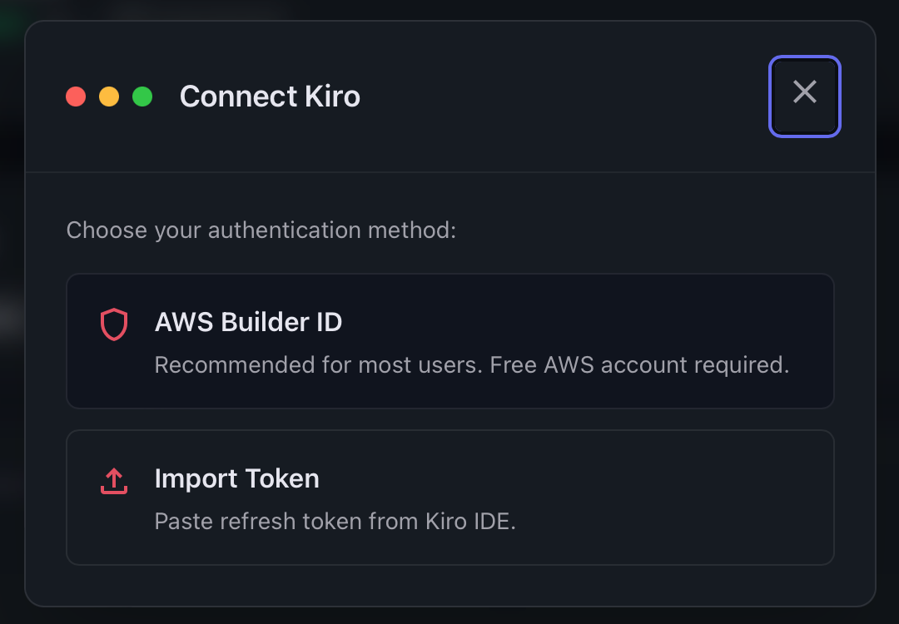
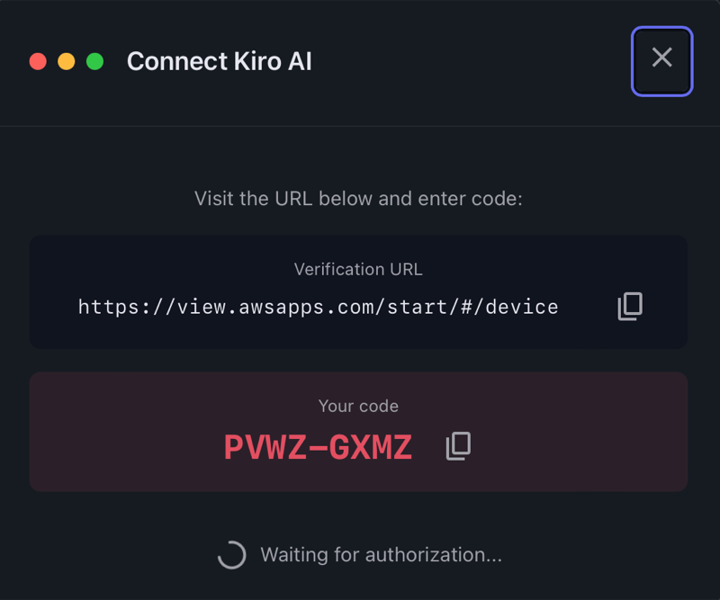
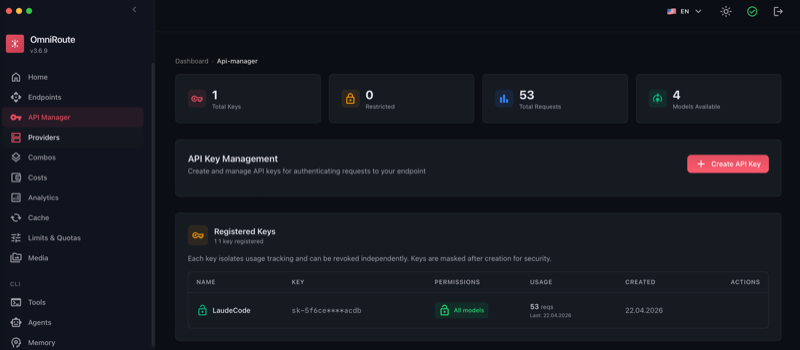
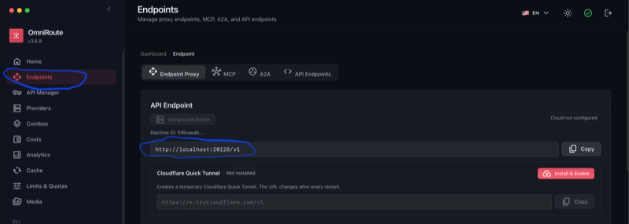
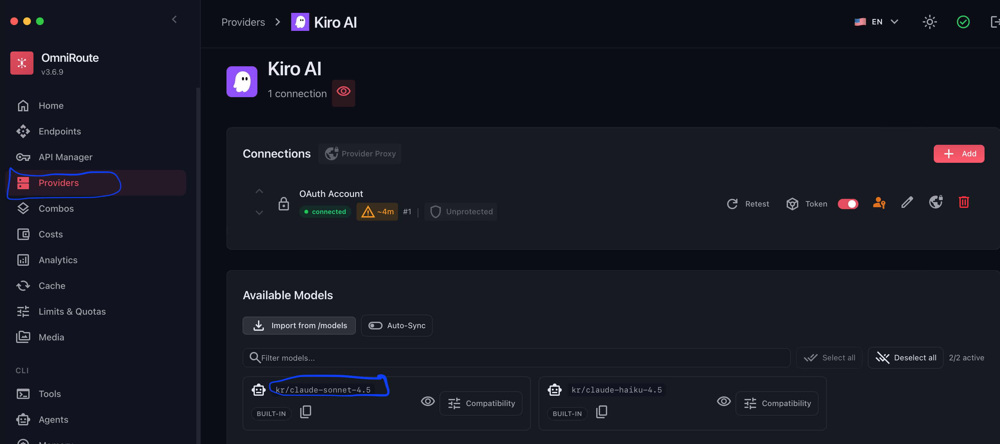

## Проверить версию `node`, должна быть `v22.22.2(LTS)`
```
node -v
```
## Устанавить `omniroute`
Сделай личную директорию для глобальных npm-пакетов:
```
mkdir -p ~/.npm-global
npm config set prefix ~/.npm-global
echo 'export PATH="$HOME/.npm-global/bin:$PATH"' >> ~/.zshrc
```
Применить:
```
source ~/.zshrc
```
Потом установить:
```
npm install -g omniroute
```
Проверка:
```
which omniroute
omniroute --help
```
## Установить `claude code`
```
npm install -g @anthropic-ai/claude-code
```

## Запускаем `omniroute`
```
omniroute
```
Выбираем `провайдеры` - `Kiro AI`

Нажимаем `добавить соединение` - `AWS Builder ID`

Нажимаем на ссылку и верифицируемся...

Возвращаемся в omniroute и видим, что подключена учетная запись к Kiro AI. Теперь нужно создать ключ. Переходим в `менеджер API` - `создать ключ API`

Придумать имя (например: CloudeCode)
`ОБЯЗАТЕЛЬНО!!!` сохрани ключ!!!

## запускаем claude code с подменными переменными на mac
Создать и сохранить в файл `start-claude.sh`. 
Заменить `YOUR_KEY`, `YOUR_URL`, `YOUR_MODEL`, `_YOU_`.
* `YOUR_KEY` - сохраняли ранее
* `YOUR_URL`

* `YOUR_MODEL` -

```
#!/bin/zsh

# API Key
export ANTHROPIC_AUTH_TOKEN="YOUR_KEY"

# OmniRoute endpoint
export ANTHROPIC_BASE_URL="YOUR_URL"

# ЯВНОЕ указание модели (если требуется)
export ANTHROPIC_MODEL="YOUR_MODEL"

# Если gateway не любит experimental betas
export CLAUDE_CODE_DISABLE_EXPERIMENTAL_BETAS=1

exec /Users/_YOU_/.npm-global/bin/claude
```
Если файл лежит на рабочем столе macOS (Desktop), команда будет такая:
```
chmod +x ~/Desktop/start-claude.sh
```
Запуск:
```
~/Desktop/start-claude.sh
```


Запуск сначала omniroute, потом cloude
```
omniroute
~/Desktop/start-claude.sh
```

ИЛИ создать файл `start-claude.command`, который по двойному клику будет запускать сам
```
#!/bin/zsh

# =====================================
# OmniRoute + Claude Code
# запуск по двойному клику
# =====================================

echo "🚀 Запускаю OmniRoute..."

omniroute > ~/omniroute.log 2>&1 &
OMNI_PID=$!

echo "⏳ Жду запуск OmniRoute..."

TRIES=0

until curl -s http://localhost:20128/v1/models > /dev/null 2>&1
do
    sleep 1
    TRIES=$((TRIES + 1))

    if [ $TRIES -gt 30 ]; then
        echo "❌ OmniRoute не запустился"
        echo "Лог: ~/omniroute.log"
        read -n 1 -s -r -p "Нажми любую клавишу..."
        exit 1
    fi
done

echo "✅ OmniRoute запущен"

export ANTHROPIC_AUTH_TOKEN="YOUR_KEY"
export ANTHROPIC_BASE_URL="http://localhost:20128/v1"
export ANTHROPIC_MODEL="kr/claude-sonnet-4.5"
export CLAUDE_CODE_DISABLE_EXPERIMENTAL_BETAS=1

echo "🤖 Запускаю Claude Code..."

exec claude
```

# НАСЛАЖДАЕМСЯ)